Image only transforms
=====================

MultiplicativeNoise
-------------------

API link: :class:`~albumentations.augmentations.transforms.MultiplicativeNoise`

1. Original image
2. :code:`MultiplicativeNoise(multiplier=0.5, p=1)`
3. :code:`MultiplicativeNoise(multiplier=1.5, p=1)`
4. :code:`MultiplicativeNoise(multiplier=[0.5, 1.5], per_channel=True, p=1)`
5. :code:`MultiplicativeNoise(multiplier=[0.5, 1.5], elementwise=True, p=1)`
6. :code:`MultiplicativeNoise(multiplier=[0.5, 1.5], elementwise=True, per_channel=True, p=1)`

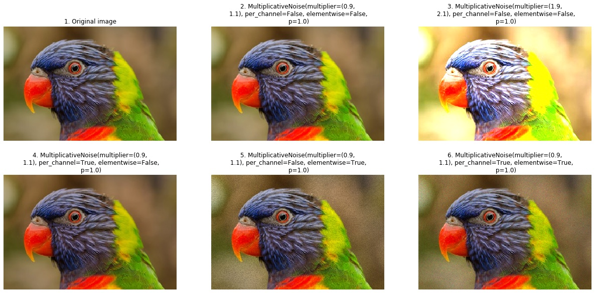

ToSepia
-------------------

API link: :class:`~albumentations.augmentations.transforms.ToSepia`

1. Original image
2. :code:`ToSepia(p=1)`

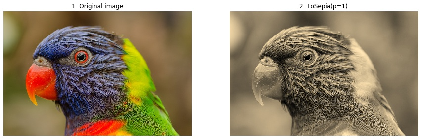

JpegCompression
-------------------

API link: :class:`~albumentations.augmentations.transforms.JpegCompression`

1. Original image
2. :code:`JpegCompression(quality_lower=99, quality_upper=100, p=1.0)`
3. :code:`JpegCompression(quality_lower=59, quality_upper=60, p=1.0)`
4. :code:`JpegCompression(quality_lower=39, quality_upper=40, p=1.0)`
5. :code:`JpegCompression(quality_lower=19, quality_upper=20, p=1.0)`
6. :code:`JpegCompression(quality_lower=0, quality_upper=1, p=1.0)`

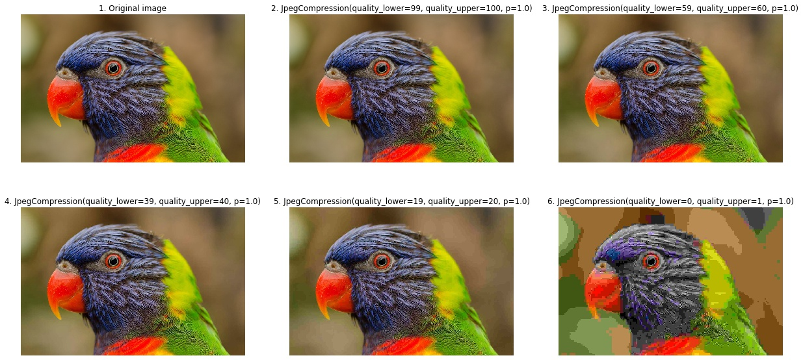

Blur
-------------------

API link: :class:`~albumentations.augmentations.transforms.Blur`

1. Original image
2. :code:`Blur(blur_limit=7, p=1.0)`
3. :code:`Blur(blur_limit=15, p=1.0)`
4. :code:`Blur(blur_limit=50, p=1.0)`
5. :code:`Blur(blur_limit=100, p=1.0)`
6. :code:`Blur(blur_limit=300, p=1.0)`

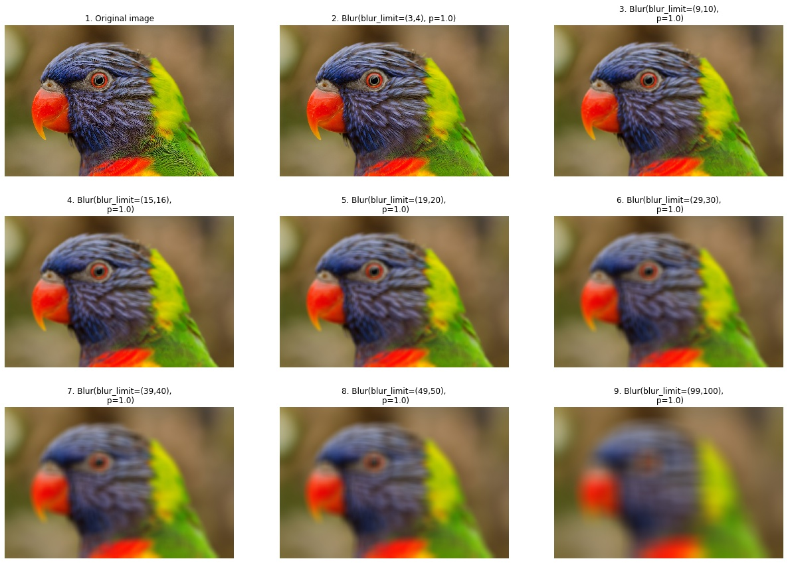

ChannelDropout
-------------------

API link: :class:`~albumentations.augmentations.transforms.ChannelDropout`

1. Original image
2. :code:`ChannelDropout(channel_drop_range=(1, 1), fill_value=0, p=1.0)`
3. :code:`ChannelDropout(channel_drop_range=(1, 1), fill_value=0, p=1.0)`
4. :code:`ChannelDropout(channel_drop_range=(1, 1), fill_value=0, p=1.0)`
5. :code:`ChannelDropout(channel_drop_range=(1, 1), fill_value=128, p=1.0)`
6. :code:`ChannelDropout(channel_drop_range=(1, 1), fill_value=255, p=1.0)`
7. :code:`ChannelDropout(channel_drop_range=(2, 2), fill_value=0, p=1.0)`
8. :code:`ChannelDropout(channel_drop_range=(2, 2), fill_value=128, p=1.0)`
9. :code:`ChannelDropout(channel_drop_range=(2, 2), fill_value=255, p=1.0)`

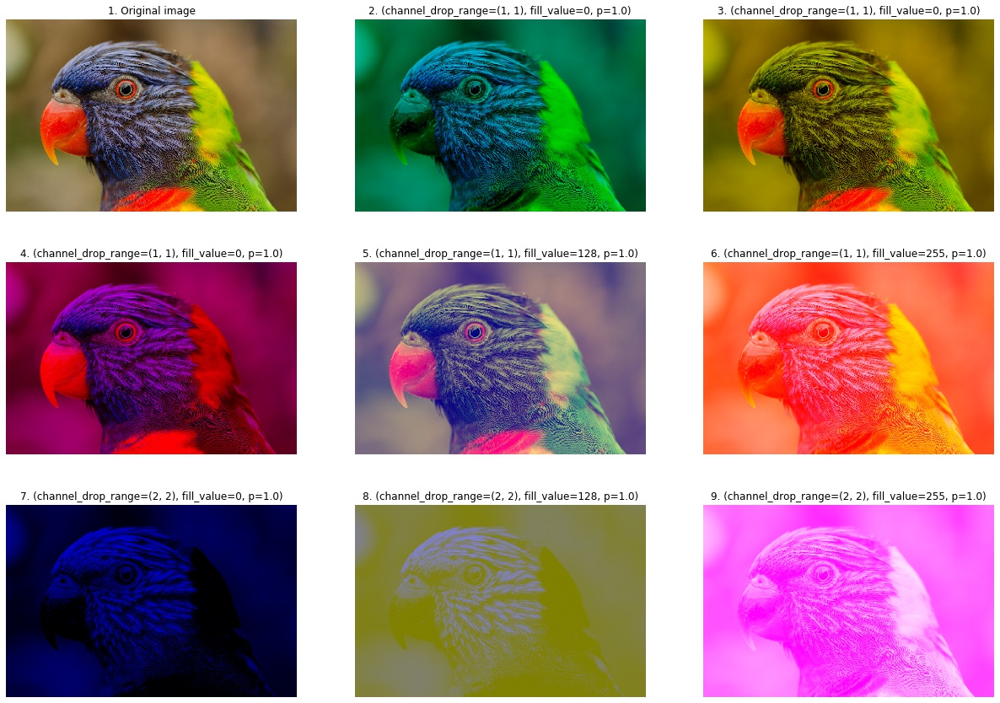

ChannelShuffle
-------------------

API link: :class:`~albumentations.augmentations.transforms.ChannelShuffle`

1. Original image
2. :code:`ChannelShuffle(p=1.0)`
3. :code:`ChannelShuffle(p=1.0)`
4. :code:`ChannelShuffle(p=1.0)`

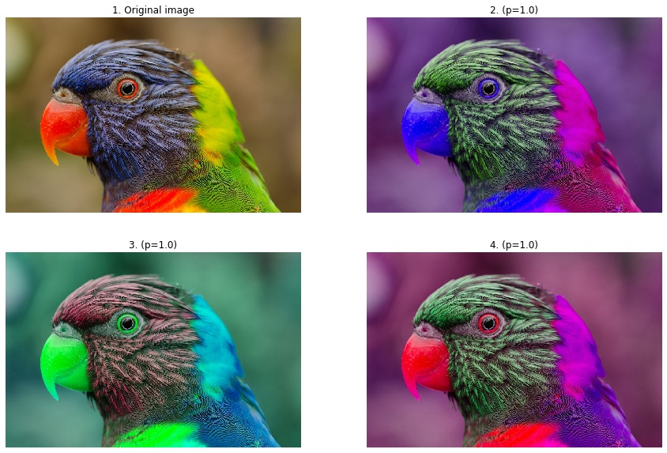

Cutout
-------------------

API link: :class:`~albumentations.augmentations.transforms.Cutout`

1. Original image
2. :code:`Cutout(num_holes=8, max_h_size=8, max_w_size=8, fill_value=0,p=1.0)`
3. :code:`Cutout(num_holes=10, max_h_size=20, max_w_size=20, fill_value=0,p=1.0)`
4. :code:`Cutout(num_holes=30, max_h_size=30, max_w_size=30, fill_value=64,p=1.0)`
5. :code:`Cutout(num_holes=50, max_h_size=40, max_w_size=40, fill_value=128,p=1.0)`
6. :code:`Cutout(num_holes=100, max_h_size=50, max_w_size=50, fill_value=255,p=1.0)`

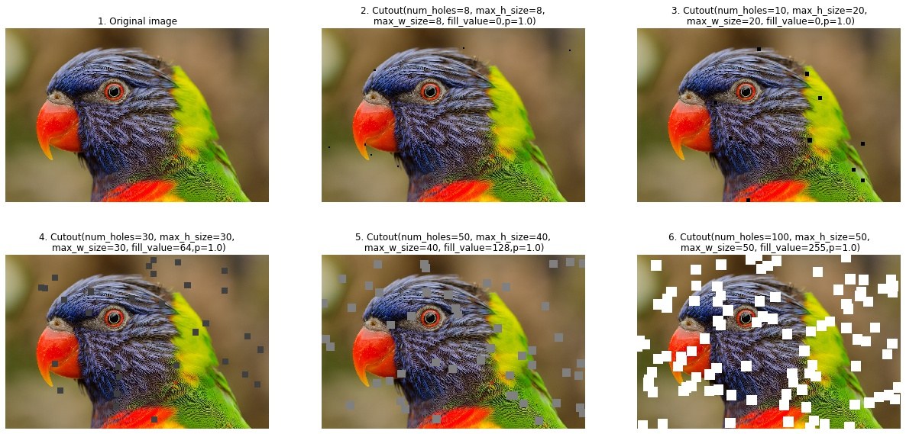

ToGray
-------------------

API link: :class:`~albumentations.augmentations.transforms.ToGray`

1. Original image
2. :code:`ToGray(p=1.0)`

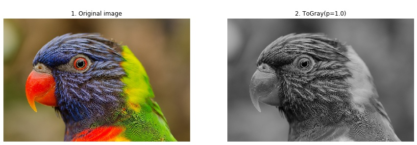

InvertImg
-------------------

API link: :class:`~albumentations.augmentations.transforms.InvertImg`

1. Original image
2. :code:`InvertImg(p=1.0)`

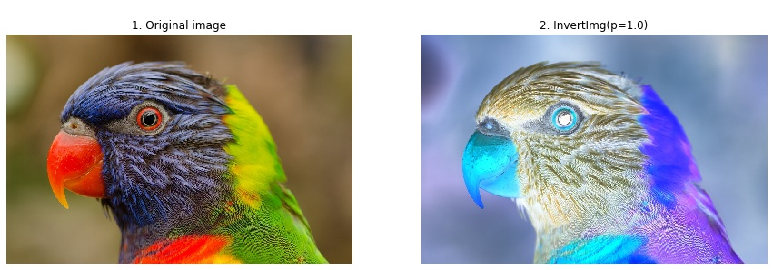

VerticalFlip
-------------------

API link: :class:`~albumentations.augmentations.transforms.VerticalFlip`

1. Original image
2. :code:`VerticalFlip(p=1.0)`

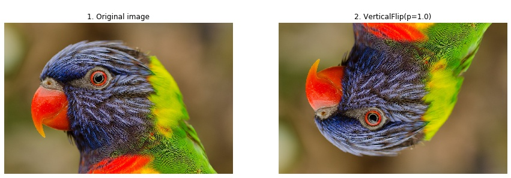

HorizontalFlip
-------------------

API link: :class:`~albumentations.augmentations.transforms.HorizontalFlip`

1. Original image
2. :code:`HorizontalFlip(p=1.0)`

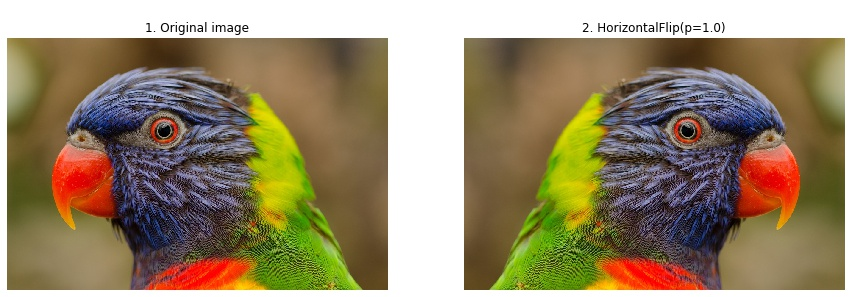

Flip
-------------------

API link: :class:`~albumentations.augmentations.transforms.Flip`

1. Original image
2. :code:`Flip(p=1.0)`
3. :code:`Flip(p=1.0)`
4. :code:`Flip(p=1.0)`

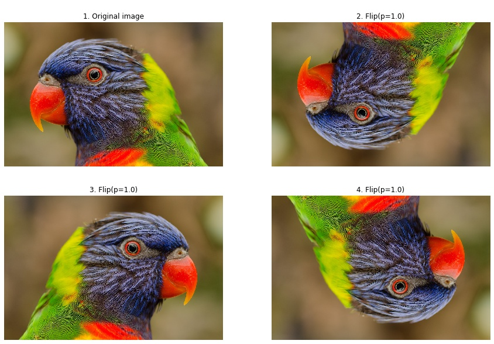

RandomGridShuffle
-------------------

API link: :class:`~albumentations.augmentations.transforms.RandomGridShuffle`

1. Original image
2. :code:`RandomGridShuffle(grid=(3, 3), p=1.0)`
3. :code:`RandomGridShuffle(grid=(5, 5), p=1.0)`
4. :code:`RandomGridShuffle(grid=(7, 7), p=1.0)`

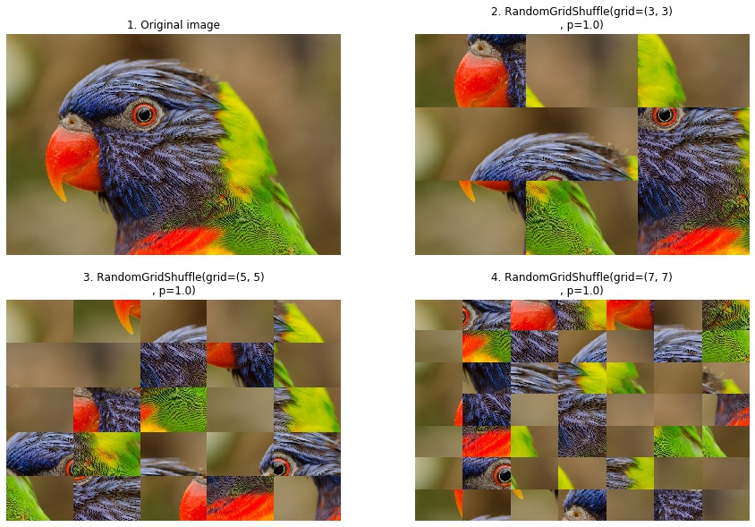
