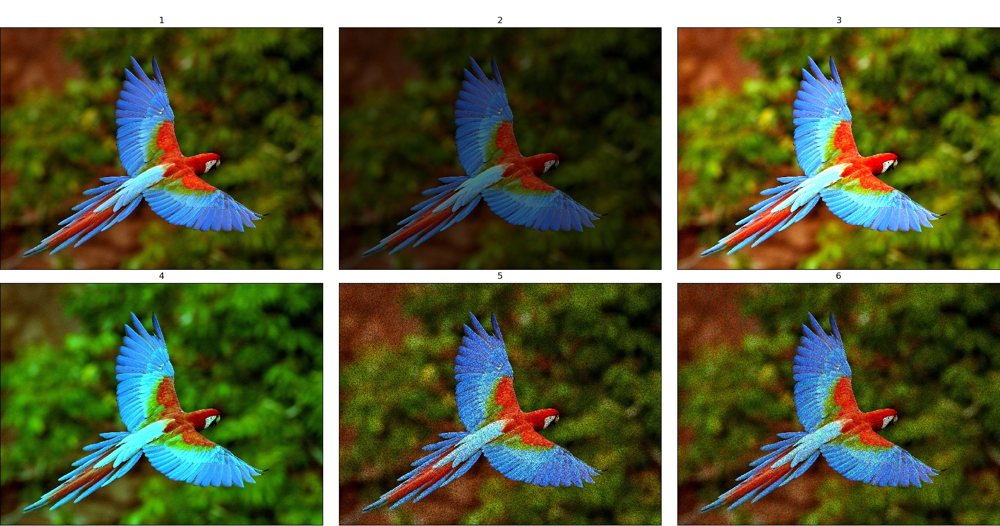

Image only transforms
=====================

MultiplicativeNoise
-------------------

API link: :class:`~albumentations.augmentations.transforms.MultiplicativeNoise`

1. Original image
2. :code:`MultiplicativeNoise(multiplier=0.5, p=1)`
3. :code:`MultiplicativeNoise(multiplier=1.5, p=1)`
4. :code:`MultiplicativeNoise(multiplier=[0.5, 1.5], per_channel=True, p=1)`
5. :code:`MultiplicativeNoise(multiplier=[0.5, 1.5], elementwise=True, p=1)`
6. :code:`MultiplicativeNoise(multiplier=[0.5, 1.5], elementwise=True, per_channel=True, p=1)`

ToSepia
-------------------

API link: :class:`~albumentations.augmentations.transforms.ToSepia`

1. Original image
2. :code:`ToSepia(p=1)`

.. figure:: ./images/ToSepia.jpg
    :alt: ToSepia image

JpegCompression
-------------------

API link: :class:`~albumentations.augmentations.transforms.JpegCompression`

1. Original image
2. :code:`JpegCompression(quality_lower=99, quality_upper=100, p=1.0)`
3. :code:`JpegCompression(quality_lower=59, quality_upper=60, p=1.0)`
4. :code:`JpegCompression(quality_lower=39, quality_upper=40, p=1.0)`
5. :code:`JpegCompression(quality_lower=19, quality_upper=20, p=1.0)`
6. :code:`JpegCompression(quality_lower=0, quality_upper=1, p=1.0)`

.. figure:: ./images/JpegCompression.jpg
    :alt: JpegCompression image

ChannelDropout
-------------------

API link: :class:`~albumentations.augmentations.transforms.ChannelDropout`

1. Original image
2. :code:`ChannelDropout(channel_drop_range=(1, 1), fill_value=0, p=1.0)`
3. :code:`ChannelDropout(channel_drop_range=(1, 1), fill_value=0, p=1.0)`
4. :code:`ChannelDropout(channel_drop_range=(1, 1), fill_value=0, p=1.0)`
5. :code:`ChannelDropout(channel_drop_range=(1, 1), fill_value=128, p=1.0)`
6. :code:`ChannelDropout(channel_drop_range=(1, 1), fill_value=255, p=1.0)`
7. :code:`ChannelDropout(channel_drop_range=(2, 2), fill_value=0, p=1.0)`
8. :code:`ChannelDropout(channel_drop_range=(2, 2), fill_value=128, p=1.0)`
9. :code:`ChannelDropout(channel_drop_range=(2, 2), fill_value=255, p=1.0)`

.. figure:: ./images/ChannelDropout.jpg
    :alt: ChannelDropout image

ChannelShuffle
-------------------

API link: :class:`~albumentations.augmentations.transforms.ChannelShuffle`

1. Original image
2. :code:`ChannelShuffle(p=1.0)`
3. :code:`ChannelShuffle(p=1.0)`
4. :code:`ChannelShuffle(p=1.0)`

.. figure:: ./images/ChannelShuffle.jpg
    :alt: ChannelShuffle image

Cutout
-------------------

API link: :class:`~albumentations.augmentations.transforms.Cutout`

1. Original image
2. :code:`Cutout(num_holes=8, max_h_size=8, max_w_size=8, fill_value=0,p=1.0)`
3. :code:`Cutout(num_holes=10, max_h_size=20, max_w_size=20, fill_value=0,p=1.0)`
4. :code:`Cutout(num_holes=30, max_h_size=30, max_w_size=30, fill_value=64,p=1.0)`
5. :code:`Cutout(num_holes=50, max_h_size=40, max_w_size=40, fill_value=128,p=1.0)`
6. :code:`Cutout(num_holes=100, max_h_size=50, max_w_size=50, fill_value=255,p=1.0)`

.. figure:: ./images/Cutout.jpg
    :alt: Cutout image

ToGray
-------------------

API link: :class:`~albumentations.augmentations.transforms.ToGray`

1. Original image
2. :code:`ToGray(p=1.0)`

.. figure:: ./images/ToGray.jpg
    :alt: ToGray image

InvertImg
-------------------

API link: :class:`~albumentations.augmentations.transforms.InvertImg`

1. Original image
2. :code:`InvertImg(p=1.0)`

.. figure:: ./images/InvertImg.jpg
    :alt: InvertImg image

VerticalFlip
-------------------

API link: :class:`~albumentations.augmentations.transforms.VerticalFlip`

1. Original image
2. :code:`VerticalFlip(p=1.0)`

.. figure:: ./images/VerticalFlip.jpg
    :alt: VerticalFlip image

HorizontalFlip
-------------------

API link: :class:`~albumentations.augmentations.transforms.HorizontalFlip`

1. Original image
2. :code:`HorizontalFlip(p=1.0)`

.. figure:: ./images/HorizontalFlip.jpg
    :alt: HorizontalFlip image

Flip
-------------------

API link: :class:`~albumentations.augmentations.transforms.Flip`

1. Original image
2. :code:`Flip(p=1.0)`
3. :code:`Flip(p=1.0)`
4. :code:`Flip(p=1.0)`

.. figure:: ./images/Flip.jpg
    :alt: Flip image

RandomGridShuffle
-------------------

API link: :class:`~albumentations.augmentations.transforms.RandomGridShuffle`

1. Original image
2. :code:`RandomGridShuffle(grid=(3, 3), p=1.0)`
3. :code:`RandomGridShuffle(grid=(5, 5), p=1.0)`
4. :code:`RandomGridShuffle(grid=(7, 7), p=1.0)`

.. figure:: ./images/RandomGridShuffle.jpg
    :alt: RandomGridShuffle image

Blur
-------------------

API link: :class:`~albumentations.augmentations.transforms.Blur`

1. Original image
2. :code:`Blur(blur_limit=(3,4), p=1.0)`
3. :code:`Blur(blur_limit=(9,10), p=1.0)`
4. :code:`Blur(blur_limit=(15,16), p=1.0)`
5. :code:`Blur(blur_limit=(19,20), p=1.0)`
6. :code:`Blur(blur_limit=(29,30), p=1.0)`
7. :code:`Blur(blur_limit=(39,40), p=1.0)`
8. :code:`Blur(blur_limit=(49,50), p=1.0)`
9. :code:`Blur(blur_limit=(99,100), p=1.0)`

.. figure:: ./images/Blur.jpg
    :alt: Blur image

GaussianBlur
-------------------

API link: :class:`~albumentations.augmentations.transforms.GaussianBlur`

1. Original image
2. :code:`GaussianBlur(blur_limit=(3,4), p=1.0)`
3. :code:`GaussianBlur(blur_limit=(9,10), p=1.0)`
4. :code:`GaussianBlur(blur_limit=(15,16), p=1.0)`
5. :code:`GaussianBlur(blur_limit=(19,20), p=1.0)`
6. :code:`GaussianBlur(blur_limit=(29,30), p=1.0)`
7. :code:`GaussianBlur(blur_limit=(39,40), p=1.0)`
8. :code:`GaussianBlur(blur_limit=(49,50), p=1.0)`
9. :code:`GaussianBlur(blur_limit=(99,100), p=1.0)`

.. figure:: ./images/GaussianBlur.jpg
    :alt: GaussianBlur image

MedianBlur
-------------------

API link: :class:`~albumentations.augmentations.transforms.MedianBlur`

1. Original image
2. :code:`MedianBlur(blur_limit=(3,4), p=1.0)`
3. :code:`MedianBlur(blur_limit=(9,10), p=1.0)`
4. :code:`MedianBlur(blur_limit=(15,16), p=1.0)`
5. :code:`MedianBlur(blur_limit=(19,20), p=1.0)`
6. :code:`MedianBlur(blur_limit=(29,30), p=1.0)`
7. :code:`MedianBlur(blur_limit=(39,40), p=1.0)`
8. :code:`MedianBlur(blur_limit=(49,50), p=1.0)`
9. :code:`MedianBlur(blur_limit=(99,100), p=1.0)`

.. figure:: ./images/MedianBlur.jpg
    :alt: MedianBlur image

MotionBlur
-------------------

API link: :class:`~albumentations.augmentations.transforms.MotionBlur`

1. Original image
2. :code:`MotionBlur(blur_limit=(3,4), p=1.0)`
3. :code:`MotionBlur(blur_limit=(9,10), p=1.0)`
4. :code:`MotionBlur(blur_limit=(15,16), p=1.0)`
5. :code:`MotionBlur(blur_limit=(19,20), p=1.0)`
6. :code:`MotionBlur(blur_limit=(29,30), p=1.0)`
7. :code:`MotionBlur(blur_limit=(39,40), p=1.0)`
8. :code:`MotionBlur(blur_limit=(49,50), p=1.0)`
9. :code:`MotionBlur(blur_limit=(99,100), p=1.0)`

.. figure:: ./images/MotionBlur.jpg
    :alt: MotionBlur image

CLAHE
-------------------

API link: :class:`~albumentations.augmentations.transforms.CLAHE`

1. Original image
2. :code:`CLAHE(clip_limit=4.0, tile_grid_size=(8, 8), p=1.0)`
3. :code:`CLAHE(clip_limit=(2,2), tile_grid_size=(8, 8), p=1.0)`
4. :code:`CLAHE(clip_limit=(4,4), tile_grid_size=(8, 8), p=1.0)`
5. :code:`CLAHE(clip_limit=(6,6), tile_grid_size=(8, 8), p=1.0)`
6. :code:`CLAHE(clip_limit=(6,6), tile_grid_size=(5, 5), p=1.0)`
7. :code:`CLAHE(clip_limit=(6,6), tile_grid_size=(3, 3), p=1.0)`
8. :code:`CLAHE(clip_limit=(6,6), tile_grid_size=(15, 15), p=1.0)`
9. :code:`CLAHE(clip_limit=(6,6), tile_grid_size=(25, 25), p=1.0)`

.. figure:: ./images/CLAHE.jpg
    :alt: CLAHE image

CoarseDropout
-------------------

API link: :class:`~albumentations.augmentations.transforms.CoarseDropout`

1. Original image
2. :code:`CoarseDropout(max_holes=8, max_height=8, max_width=8, min_holes=None, min_height=None, min_width=None, fill_value=0, p=1.0)`
3. :code:`CoarseDropout(max_holes=15, max_height=15, max_width=15, min_holes=None, min_height=None, min_width=None, fill_value=0, p=1.0)`
4. :code:`CoarseDropout(max_holes=8, max_height=50, max_width=50, min_holes=None, min_height=None, min_width=None, fill_value=64, p=1.0)`
5. :code:`CoarseDropout(max_holes=8, max_height=50, max_width=50, min_holes=None, min_height=None, min_width=None, fill_value=128, p=1.0)`
6. :code:`CoarseDropout(max_holes=8, max_height=50, max_width=50, min_holes=None, min_height=None, min_width=None, fill_value=255, p=1.0)`

.. figure:: ./images/CoarseDropout.jpg
    :alt: CoarseDropout image

Downscale
-------------------

API link: :class:`~albumentations.augmentations.transforms.Downscale`

1. Original image
2. :code:`Downscale(scale_min=0.25, scale_max=0.25, interpolation=0, p=1.0)`
3. :code:`Downscale(scale_min=0.1, scale_max=0.1, interpolation=0, p=1.0)`
4. :code:`Downscale(scale_min=0.5, scale_max=0.5, interpolation=0, p=1.0)`
5. :code:`Downscale(scale_min=0.25, scale_max=0.25, interpolation=cv2.INTER_LINEAR, p=1.0)`
6. :code:`Downscale(scale_min=0.25, scale_max=0.25, interpolation=cv2.INTER_CUBIC, p=1.0)`
7. :code:`Downscale(scale_min=0.25, scale_max=0.25, interpolation=cv2.INTER_AREA, p=1.0)`
8. :code:`Downscale(scale_min=0.25, scale_max=0.25, interpolation=cv2.INTER_LANCZOS4, p=1.0)`
9. :code:`Downscale(scale_min=0.25, scale_max=0.25, interpolation=0, p=1.0)`

.. figure:: ./images/Downscale.jpg
    :alt: Downscale image

Equalize
-------------------

API link: :class:`~albumentations.augmentations.transforms.Equalize`

1. Original image
2. :code:`Equalize(mode="cv", by_channels=True, mask=None, p=1.0)`
3. :code:`Equalize(mode="cv", by_channels=False, mask=None, p=1.0)`
4. :code:`Equalize(mode="pil", by_channels=True, mask=None, p=1.0)`
5. :code:`Equalize(mode="pil", by_channels=False, mask=None, p=1.0)`
6. :code:`Equalize(mode="cv", by_channels=True, mask=np.concatenate([np.ones((212,70)), np.zeros((212,250))], 1), p=1.0)`

.. figure:: ./images/Equalize.jpg
    :alt: Equalize image

GaussNoise
-------------------

API link: :class:`~albumentations.augmentations.transforms.GaussNoise`

1. Original image
2. :code:`GaussNoise(var_limit=(10.0, 10.0), mean=0, p=1.0)`
3. :code:`GaussNoise(var_limit=(50.0, 50.0), mean=0, p=1.0)`
4. :code:`GaussNoise(var_limit=(100.0, 100.0), mean=0, p=1.0)`
5. :code:`GaussNoise(var_limit=(200.0, 200.0), mean=00, p=1.0)`
6. :code:`GaussNoise(var_limit=(30.0, 30.0), mean=50, p=1.0)`

.. figure:: ./images/GaussNoise.jpg
    :alt: GaussNoise image

HueSaturationValue
-------------------

API link: :class:`~albumentations.augmentations.transforms.HueSaturationValue`

1. Original image
2. :code:`HueSaturationValue(hue_shift_limit=(20,20), sat_shift_limit=(20,20), val_shift_limit=(20,20), p=1.0)`
3. :code:`HueSaturationValue(hue_shift_limit=(-20,-20), sat_shift_limit=(-20,-20), val_shift_limit=(-20,-20), p=1.0)`
4. :code:`HueSaturationValue(hue_shift_limit=(20,20), sat_shift_limit=0, val_shift_limit=0, p=1.0)`
5. :code:`HueSaturationValue(hue_shift_limit=0, sat_shift_limit=(20,20), val_shift_limit=0, p=1.0)`
6. :code:`HueSaturationValue(hue_shift_limit=0, sat_shift_limit=0, val_shift_limit=(20,20), p=1.0)`
7. :code:`HueSaturationValue(hue_shift_limit=(-20,-20), sat_shift_limit=0, val_shift_limit=0, p=1.0)`
8. :code:`HueSaturationValue(hue_shift_limit=0, sat_shift_limit=(-20,-20), val_shift_limit=0, p=1.0)`
9. :code:`HueSaturationValue(hue_shift_limit=0, sat_shift_limit=0, val_shift_limit=(-20,-20), p=1.0)`

.. figure:: ./images/HueSaturationValue.jpg
    :alt: HueSaturationValue image

ImageCompression
-------------------

API link: :class:`~albumentations.augmentations.transforms.ImageCompression`

1. Original image
2. :code:`ImageCompression(quality_lower=99, quality_upper=100, compression_type=0, p=1.0)`
3. :code:`ImageCompression(quality_lower=59, quality_upper=60, compression_type=0, p=1.0)`
4. :code:`ImageCompression(quality_lower=19, quality_upper=20, compression_type=0, p=1.0)`
5. :code:`ImageCompression(quality_lower=59, quality_upper=60, compression_type=1, p=1.0)`
6. :code:`ImageCompression(quality_lower=19, quality_upper=20, compression_type=1, p=1.0)`

.. figure:: ./images/ImageCompression.jpg
    :alt: ImageCompression image

MultiplicativeNoise
-------------------

API link: :class:`~albumentations.augmentations.transforms.MultiplicativeNoise`

1. Original image
2. :code:`MultiplicativeNoise(multiplier=(0.9, 1.1), per_channel=False, elementwise=False, p=1.0)`
3. :code:`MultiplicativeNoise(multiplier=(1.9, 2.1), per_channel=False, elementwise=False, p=1.0)`
4. :code:`MultiplicativeNoise(multiplier=(0.9, 1.1), per_channel=True, elementwise=False, p=1.0)`
5. :code:`MultiplicativeNoise(multiplier=(0.9, 1.1), per_channel=False, elementwise=True, p=1.0)`
6. :code:`MultiplicativeNoise(multiplier=(0.9, 1.1), per_channel=True, elementwise=True, p=1.0)`

Posterize
-------------------

API link: :class:`~albumentations.augmentations.transforms.Posterize`

1. Original image
2. :code:`Posterize(num_bits=7, p=1.0)`
3. :code:`Posterize(num_bits=6, p=1.0)`
4. :code:`Posterize(num_bits=5, p=1.0)`
5. :code:`Posterize(num_bits=4, p=1.0)`
6. :code:`Posterize(num_bits=3, p=1.0)`
7. :code:`Posterize(num_bits=2, p=1.0)`
8. :code:`Posterize(num_bits=2, p=1.0)`
9. :code:`Posterize(num_bits=[[0, 0], [3, 3], [8, 8]], p=1.0)`

.. figure:: ./images/Posterize.jpg
    :alt: Posterize image

RandomBrightness
-------------------

API link: :class:`~albumentations.augmentations.transforms.RandomBrightness`

1. Original image
2. :code:`RandomBrightness(limit=(0.1, 0.1), p=1.0)`
3. :code:`RandomBrightness(limit=(0.3, 0.3), p=1.0)`
4. :code:`RandomBrightness(limit=(0.5, 0.5), p=1.0)`
5. :code:`RandomBrightness(limit=(-0.1, -0.1), p=1.0)`
6. :code:`RandomBrightness(limit=(-0.3, -0.3), p=1.0)`

.. figure:: ./images/RandomBrightness.jpg
    :alt: RandomBrightness image

RandomContrast
-------------------

API link: :class:`~albumentations.augmentations.transforms.RandomContrast`

1. Original image
2. :code:`RandomContrast(limit=(0.1, 0.1), p=1.0)`
3. :code:`RandomContrast(limit=(0.3, 0.3), p=1.0)`
4. :code:`RandomContrast(limit=(0.5, 0.5), p=1.0)`
5. :code:`RandomContrast(limit=(-0.1, -0.1), p=1.0)`
6. :code:`RandomContrast(limit=(-0.3, -0.3), p=1.0)`

.. figure:: ./images/RandomContrast.jpg
    :alt: RandomContrast image

RandomBrightnessContrast
-------------------

API link: :class:`~albumentations.augmentations.transforms.RandomBrightnessContrast`

1. Original image
2. :code:`RandomBrightnessContrast(brightness_limit=(0.2, 0.2), contrast_limit=(0.2, 0.2), p=1.0)`
3. :code:`RandomBrightnessContrast(brightness_limit=(0.2, 0.2), contrast_limit=(-0.2, -0.2), p=1.0)`
4. :code:`RandomBrightnessContrast(brightness_limit=(-0.2, -0.2), contrast_limit=(0.2, 0.2), p=1.0)`
5. :code:`RandomBrightnessContrast(brightness_limit=(-0.2, -0.2), contrast_limit=(-0.2, -0.2), p=1.0)`
6. :code:`RandomBrightnessContrast(brightness_limit=(-0.2, 0.2), contrast_limit=(-0.2, 0.2), p=1.0)`

.. figure:: ./images/RandomBrightnessContrast.jpg
    :alt: RandomBrightnessContrast image

RandomGamma
-------------------

API link: :class:`~albumentations.augmentations.transforms.RandomGamma`

1. Original image
2. :code:`RandomGamma(gamma_limit=(80, 90), p=1.0)`
3. :code:`RandomGamma(gamma_limit=(60, 70), p=1.0)`
4. :code:`RandomGamma(gamma_limit=(110, 120), p=1.0)`
5. :code:`RandomGamma(gamma_limit=(130, 140), p=1.0)`
6. :code:`RandomGamma(gamma_limit=(150, 160), p=1.0)`

.. figure:: ./images/RandomGamma.jpg
    :alt: RandomGamma image

Solarize
-------------------

API link: :class:`~albumentations.augmentations.transforms.Solarize`

1. Original image
2. :code:`Solarize(threshold=16, p=1.0)`
3. :code:`Solarize(threshold=32, p=1.0)`
4. :code:`Solarize(threshold=64, p=1.0)`
5. :code:`Solarize(threshold=128, p=1.0)`
6. :code:`Solarize(threshold=192, p=1.0)`

.. figure:: ./images/Solarize.jpg
    :alt: Solarize image
